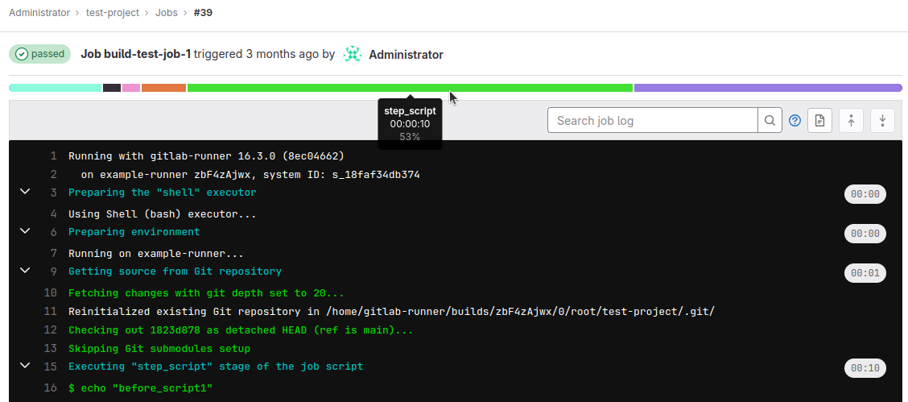

# ci-timeline-visualizer



This repository contains the code of an extension for the [GitLab](https://gitlab.com/gitlab-org/gitlab) job log page.
Its aim is to visualize the elapsed execution time between the [job sections](https://docs.gitlab.com/ce/ci/jobs/index.html#expand-and-collapse-job-log-sections).

## Usage

### Dependencies

Run `npm install` to install the build dependencies.

### Configuring

If you'd like to configure the visualizer, you can do that in the `custom-config.js` file located in the root of the project.
It's an ES6 module with a single exported JavaScript object.
This way the config will be embedded in the bundled files, keeping their amount to a minimum.

The file contains the documentation strings explaining what each of the configurable values does.
If you are unsure about the config structure, take a peek into the `modules/ConfigManager.js` file.

Configurable values you might want to take a look at first include:
* `URLs.rootResolveMode` - if your GitLab instance has namespaces with `/git/` or `/gitlab-instance/` in them.

### Building

Run `npm run build` to obtain a bundle.

### Using as a library

Your HTML should include the following elements:
* `<link rel="stylesheet" type="text/css" href="ci-timeline-visualizer.css">`
* `<script type="module" src="ci-timeline-visualizer.js"></script>`

### Developing

#### Local web server

Considering that modules only work via HTTP, it is recommended to use a local web server.
Running it locally (i.e. `file://`) will result in a CORS policy error.

Although `ci-timeline-visualizer.js` is an ES6 module, the repository includes an `index.html` file for local execution purposes.
A development server that serves it can be started by running `npm run dev`.

#### Injection

First make sure you are on the job log page (the URL should look similar to `example.com/<project-path>/-/jobs/<job-id>`).
Then, the injection process can be carried out by pasting the following code into the developer tools console in the browser:

```js
let cssLink = document.createElement("link");
cssLink.href = "http://localhost:5500/ci-timeline-visualizer.css";
cssLink.type = "text/css";
cssLink.rel = "stylesheet";
document.getElementsByTagName("head")[0].appendChild(cssLink);

let scripttag = document.createElement("script");
scripttag.setAttribute("type", "module");
scripttag.setAttribute("src", "http://localhost:5500/ci-timeline-visualizer.js");
document.getElementsByTagName("html")[0].appendChild(scripttag);
```

> You might be able to inject the above snippet by using a userscript manager (e.g. Greasemonkey) so that it happens automatically on page refresh. This has not been tested, however.

## GitLab job log syntax

GitLab uses ANSI escape sequences to format and hide certain pieces of text.

Notable ANSI escapes:
```
^[[0K - Erase in Line (EL) - erases from cursor to the end of the line
^[[x;y;m - Select Graphic Rendition (SGR) - sets colors and style of characters following this sequence
^[[0;m - (SGR 0) sets style to none
^[M - Carriage return
```

Notable job log messages:
- Section tag - marks the start or the end of a section along with its name and a Unix timestamp <br>
  Syntax: <br>
  `section_{start|end}:{unix_timestamp}:{section_name}^M^[[0K`
- Runner messages - messages such as human-readable section names, executed commands or runner data: <br>
  Syntax: <br>
  `[EL]{SGR}printed-text{SGR 0}` <br>
  Note: the `EL` sequence is optional; it doesn't appear in the command messages (e.g. `^[[32;1m$ sleep 5^[[0;m`)
- Command output - standard output of the executed commands (they are printed as-is).

Additionally, each section-tag chain ends with the `SGR 0` sequence.

Example raw job log output:
```
^[[0KRunning with gitlab-runner 16.3.0 (8ec04662)^[[0;m
^[[0K  on example-runner zbF4zAjwx, system ID: s_18faf34db374^[[0;m
section_start:1694763179:prepare_executor^M^[[0K^[[0K^[[36;1mPreparing the "shell" executor^[[0;m^[[0;m
^[[0KUsing Shell (bash) executor...^[[0;m
section_end:1694763179:prepare_executor^M^[[0Ksection_start:1694763179:prepare_script^M^[[0K^[[0K^[[36;1mPreparing environment^[[0;m^[[0;m
Running on example-runner...
section_end:1694763179:prepare_script^M^[[0Ksection_start:1694763179:get_sources^M^[[0K^[[0K^[[36;1mGetting source from Git repository^[[0;m^[[0;m
^[[32;1mFetching changes with git depth set to 20...^[[0;m
Reinitialized existing Git repository in /home/gitlab-runner/builds/zbF4zAjwx/0/root/test-project/.git/
^[[32;1mChecking out 9aefa86e as detached HEAD (ref is main)...^[[0;m
^[[32;1mSkipping Git submodules setup^[[0;m
section_end:1694763179:get_sources^M^[[0Ksection_start:1694763179:step_script^M^[[0K^[[0K^[[36;1mExecuting "step_script" stage of the job script^[[0;m^[[0;m
^[[32;1m$ echo "before_script1"^[[0;m
before_script1
^[[32;1m$ sleep 5^[[0;m
^[[32;1m$ echo "before_script2"^[[0;m
before_script2
^[[32;1m$ echo "script1"^[[0;m
script1
^[[32;1m$ sleep 2^[[0;m
^[[32;1m$ echo "script2"^[[0;m
script2
section_end:1694763186:step_script^M^[[0Ksection_start:1694763186:after_script^M^[[0K^[[0K^[[36;1mRunning after_script^[[0;m^[[0;m
^[[32;1mRunning after script...^[[0;m
^[[32;1m$ echo "after_script1"^[[0;m
after_script1
^[[32;1m$ sleep 6^[[0;m
^[[32;1m$ echo "after_script2"^[[0;m
after_script2
section_end:1694763192:after_script^M^[[0K^[[32;1mJob succeeded^[[0;m
```
